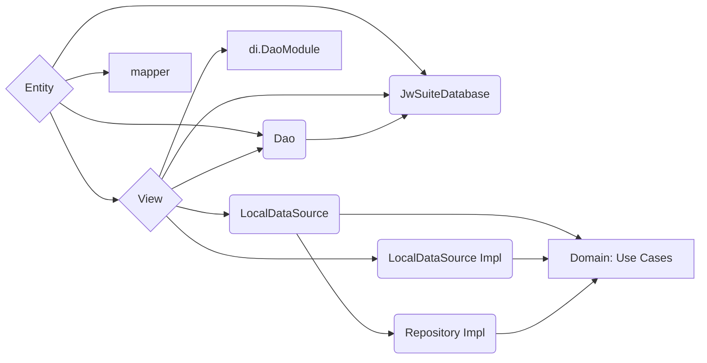
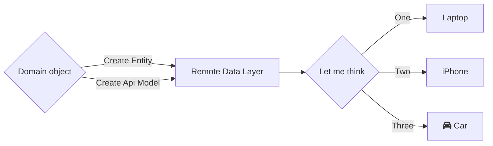
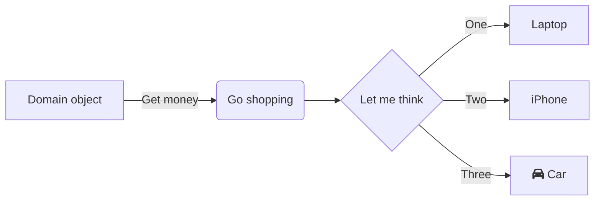

# Package com.oborodulin.jwsuite.data

Пакет реализует слой данных приложения:

## Local

```mermaid
graph LR
    A{Entity} --> B(Dao)
    A --> C{View}
    A --> D(JwSuiteDatabase)
    A --> mapper
    C --> B(Dao)
    C --> D(JwSuiteDatabase)
    B --> D(JwSuiteDatabase)
    C --> E[di.DaoModule]
    C --> F(LocalDataSource)
    C --> G(LocalDataSource Impl)
    F --> I[di.LocalDataSourcesModule]
    G --> I[di.LocalDataSourcesModule]
    F --> H(Repository Impl)
    H --> I[Domain: Use Cases]
```
## Remote

```mermaid
graph LR
    A{Domain object} -->|Create Entity| B[Local Data Layer]
    A --> |Create Api Model| B[Remote Data Layer]
    B --> C{Let me think}
    C -->|One| D[Laptop]
    C -->|Two| E[iPhone]
    C -->|Three| F[fa:fa-car Car]
```

```mermaid
graph LR
    A[Domain object] -->|Get money| B(Go shopping)
    B --> C{Let me think}
    C -->|One| D[Laptop]
    C -->|Two| E[iPhone]
    C -->|Three| F[fa:fa-car Car]
```
