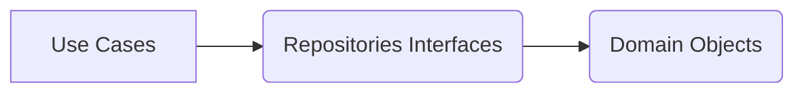
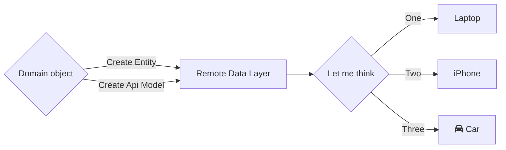
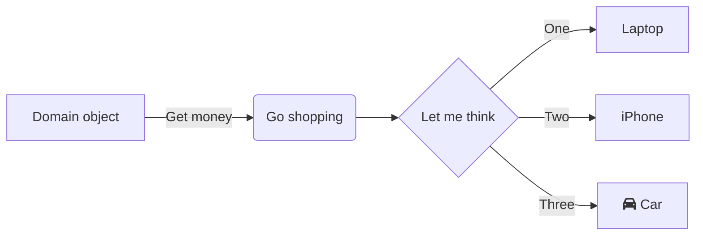

# Package com.oborodulin.jwsuite.domain

Пакет реализует доменный слой приложения:

```mermaid
graph LR
    A[Use Cases] --> B(Repositories Interfaces)
    B --> C(Domain Objects)
```
## Добавление доменного объекта

```mermaid
graph LR
    A{Domain object} -->|Create Entity| B[Local Data Layer]
    A --> |Create Api Model| B[Remote Data Layer]
    B --> C{Let me think}
    C -->|One| D[Laptop]
    C -->|Two| E[iPhone]
    C -->|Three| F[fa:fa-car Car]
```

```mermaid
graph LR
    A[Domain object] -->|Get money| B(Go shopping)
    B --> C{Let me think}
    C -->|One| D[Laptop]
    C -->|Two| E[iPhone]
    C -->|Three| F[fa:fa-car Car]
```
